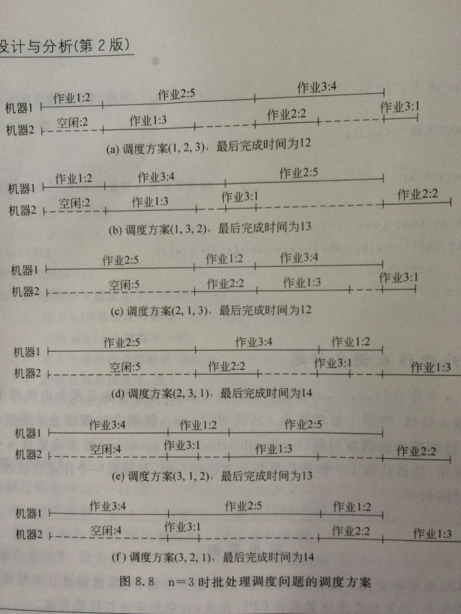

### 批处理作业调度问题
#### 问题描述

- n个作业{1,2,3,...,n}要在两台机器上处理，每个作业必须先由机器１处理，然后再由机器２处理，机器１处理作业i所需时间为ai，机器２处理作业i所需时间为bi(1<=i<=n)，**批处理作业调度问题**(batch-job scheduling problem)要求确定这n个作业的最优处理顺序，使得从第１个作业在机器１处理开始，到最后一个作业在机器２上处理结束所需时间最少。

#### 想法

- 显然，批处理作业的一个最优调度应使机器１没有空间时间，且机器２的空闲时间最小。可以证明，存在一个最优作业调度使得在机器１和机器２上作业以相同次序完成。例如，有三个作业{1,2,3}，这三个作业在机器1上所需的处理时间为(2,5,4)，在机器２上所需的处理时间为(3,2,1)，则这三个作业存在６种可能的调度方案：{(1,2,3),(1,3,2),(2,1,3),(2,3,1),(3,1,2),(3,2,1)}，相应的完成时间为{12,13,12,14,13,16}。显然，最佳的调度方案是(1,2,3)和(2,1,3)，最短完成时间为１２。

#### 存储

- 用变量ｎ存储任务个数
- 用数组machineOne[]存储n个任务在机器一上处理的时间
- 用数组machineTwo[]存储n个任务在机器二上处理的时间
- 用数组sum1[]存储机器一处理完成每个任务的总时间,sum1[0]=0,sum1[1]为处理完第一个任务的总时间,sum[2].....
- 用数组sum2[]存储机器二处理完成每个任务的总时间,sum2[0]=0,sum2[1]为处理完第一个任务的总时间(机器二需等机器一执行完当前任务才能执行),sum[2].....
- 用数组result[]存储任务的调度顺序，result[1]的值为任务的编号，如result[1]=0;表示第一个任务的编号是0,编号0在机器一上的处理时间为machineOne[0]的值...

#### 输入

- 任务数量：ｎ
- ｎ个任务在机器一分别处理所需时间：machineOne[]
- ｎ个任务在机器二分别处理所需时间：machineTwo[]
- 批处理作业调度最迟完成时间：time

#### 输出

- 批处理作业调度顺序
- 批处理作业调度最短完成时间:bestTime

#### 样例输入

- 任务数量：3
- ｎ个任务在机器一分别处理所需时间：{2,5,4}
- ｎ个任务在机器二分别处理所需时间：{3,2,1}
- 批处理作业调度最迟完成时间：20

#### 样例输出

- 当前最短作业安排是：1 2 3
- 最短时间是：12
- 批处理作业调度的最短时间是：12

#### 作业调度过程

#### 详细代码移步

- [批处理作业调度](https://github.com/Mr-Joke/Algorithm/blob/master/BackTrack/src/BatchJob.java)
