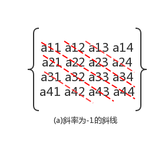
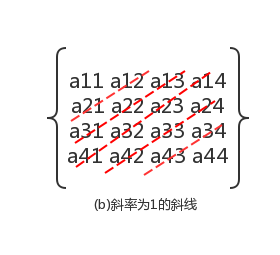
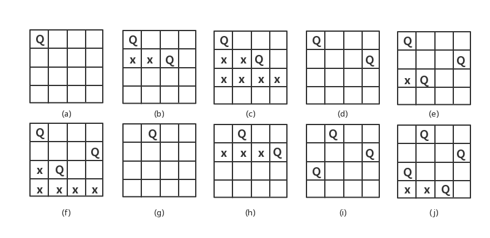

### 八皇后问题
#### 问题描述

- 八皇后问题是19世纪著名的数学家高斯于1850年提出的。问题是：在8×8的棋盘上摆放八个皇后，使其不能互相攻击，即任意的两个皇后都不能处于同一行、同一列或同一斜线上。可以把八皇后问题扩展到ｎ皇后问题，即n×n的棋盘上摆放n个皇后，使任意两个皇后都不能处于同一行、同一列或同一斜线上。

#### 想法

- 显然，棋盘的每一行可以并且必须摆放一个皇后，所以，n皇后问题的可能解用一个n元向量(x1,x2,...,xn)表示，即第i个皇后拜访在第i行第xi列的位置(1<=i<=n且1<=xi<=n)。由于两个皇后不能位于同一列，所以，n皇后问题的解向量必须满足xi!=xj。
- 可以将n皇后问题的n×n看成是矩阵，设皇后i和皇后j摆放的位置分别是(i,xi)和(j,xj)，则在棋盘上斜率为-1的同一条斜线上，满足条件i-x1 = j-xj，如图(a)，斜率为1则满足条件i+x1 = j+xj，如图(b)。综合上述两种情况，n皇后问题的解必须满足约束条件：|i-j| != |xi-xj|。

 

#### 样例输入

- **n=4**

#### 解题过程
1. 用一个数组queens[]存放皇后摆放的位置信息
2. 初始化queens{0,0,0,0}
3. 用索引index表示待考察的皇后所在行，queens[index]的值代表待考察皇后所在的列
4. 默认从index=0,queens[0]=1开始，即第一行第一列摆放第一个皇后
5. 判断皇后摆放是否冲突
  1. 比较当前皇后所在的列是否与前面的在同一列
  2. 判断当前皇后所在斜率的绝对值是否与前面摆放的斜率绝对值相等
6. 若5中有冲突，考察下一个格子
7. 若当前行所有格子都有冲突，则回溯

#### 搜索解空间

#### 皇后摆放结果

- **queens:{2,4,1,3}**

#### 详细代码移步

- [八皇后](https://github.com/Mr-Joke/Algorithm/blob/master/BackTrack/src/EightQueens.java)
