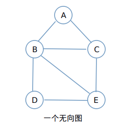
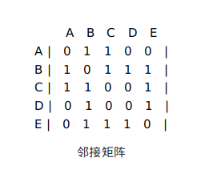
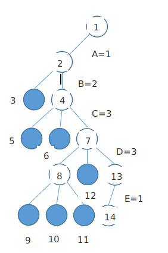

### 图着色问题
#### 问题描述

- 给定无向连通图G=(V,E)，求最小的整数m，用m种颜色对G中的顶点着色，使得任意两个相邻顶点着色不同

- 输入：n个顶点的图G=(V,E)，m种颜色
- 输出：n个顶点的涂色情况color[n]

#### 想法

- 回溯法求解图着色，首先把所有顶点的颜色初始化为０，然后一次为每一个顶点着色。在图问题的解空间树中，如果从根结点到当前结点对应一部分解，也就是所有的颜色指派都没有冲突，则在当前结点出选择第一棵子树继续搜索，也就是下一个顶点着色１，否则，对当前子树的兄弟子树继续搜索，也就是为当前顶点着下一个颜色，如果所有ｍ种颜色都已尝试过并且都发生冲突，则回溯到当前结点的父结点出，上一个顶点的颜色改变，以此类推。

#### 样例输入的图(含五个结点)

#### 图的存储

- 图的存储常用的两种结构是：邻接矩阵表示法和邻接表表示法
- **邻接矩阵**(Adjaceny Matrix)是表示顶点之间相邻关系的矩阵。设G＝(V,E)是具有n个顶点的图，则G的邻接矩阵是具有如下特性的n阶方阵：矩阵的每一个元素表示一条边(用1表示有边，0表示无边)，两个下标对应边的两个端点。
- 上图用邻接矩阵表示则如下图所示

#### 搜索解空间树

- 求上面无向图三着色的问题，在解空间树中的搜索过程如图所示

#### 涂色结果

- **color : 1 2 3 3 1**

#### 详细代码移步

- [图着色](https://github.com/Mr-Joke/Algorithm/blob/master/BackTrack/src/GraphColor.java)
