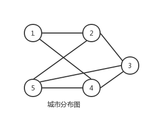
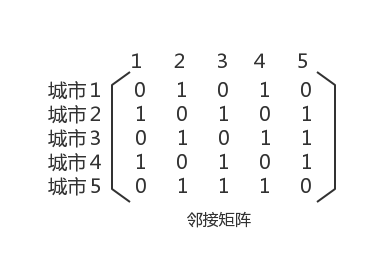
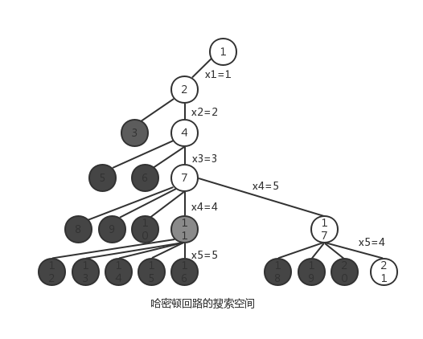

### 哈密顿回路问题

#### 想法
- 回溯法求解哈密顿问题，首先把所有顶点的访问标志初始化为0，然后在解空间树中从根结点开始搜索，如果从根结点到当前结点对应一部分解，即满足上述约束条件，则在当前结点处选择第一颗子树继续搜索，否则，对当前子树的兄弟结点进行搜索，如果当前结点的所有子树都已尝试过并且发生冲突，则回溯到当前结点的父结点。

#### 样例输入的城市结点图图

#### 图的存储(邻接矩阵)

#### 解题过程
1. 用一个数组track[]存放经过的城市结点信息
2. 初始化track[]{0,0,0,0,0}
3. 用一个索引index表示待考察城市的下标
4. 默认从第一个城市开始,track[0]=1,待考察下标就是index=1
5. 判断待考察城市是否冲突
  1. 判断该城市track[index]是否已经走过
  2. 判断该城市与前一个城市track[index-1]之间是否有边
  3. 若是最后一个城市，则判断与第一个城市是否有边
6. 若5中有冲突,则继续考察下一个城市track[index] = track[index]+1;
7. 若所有城市都考察完还是冲突，则回溯到前一个城市index = index-1;

#### 搜索解空间

#### 经过城市结果

- **track:{1,2,3,5,4}**

#### 详细代码移步

- [哈密顿回路](https://github.com/Mr-Joke/Algorithm/blob/master/BackTrack/src/Hamilton.java)
