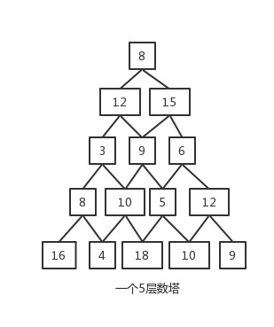
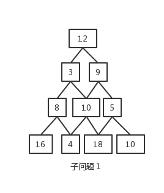
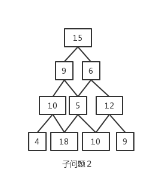

### 数塔问题
#### 问题描述

- 如图下图所示的一个数塔，从数塔的顶层出发，在每一个结点可以选择向左或向右走，一直走到最底层，要求找一条路径，使得路径上的数值和最大。例如，下图所示的数塔最大值和是8+15+9+10+18=60。

#### 想法

- 观察上图数塔不难发现，从５层数塔的塔顶(设顶层为第１层)出发，下一层选择向左还是向右取决于两个４层数塔的最大值和，下图所示，显然自问题具有重叠特征。

 

- 如何找到子问题满足的动态规划函数呢？显然，动态规划的求解需要从底层开始进行决策，具体过程如下：
  - 求解初子问题：底层的每个数字可以看做１层数塔，则最大数值和就是本身。
  - 再求解下一阶段的子问题：第４层的决策是在底层决策的基础上进行求解，可以看做４个２层数塔，对每个数塔求解。
  - 一次类推，直到最后一个阶段：第１层的决策结果就是数塔问题的整体最优解。

#### 数塔的存储

- 用一个二位数组tower[][]存储数塔
- 用一个二位数组result[][]存储最优解(每个元素存储其两个子数塔中的最大数值和)
- 用一个二位数组path[][]存储最优解的路径(上一层元素存储下一层元素的下标)
- 用一个变量存储数塔的最大和值maxValue

#### 输入

- 数塔层数：n
- n层数塔的元素：tower[][]

#### 输出

- 最优解的路径
- 最优解的值（最大数值和）

#### 样例输入

- `5`
- `8   
12 15
3 9 6
8 10 5 12
16 4 18 10 9
`

#### 样例输出

- 最优解路径为：8 15 9 10 18
- 最大数值和：60

#### 详细代码移步

- [数塔问题](https://github.com/Mr-Joke/Algorithm/blob/master/Dynamic/src/DataTower.java)
