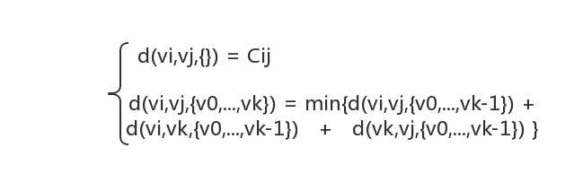
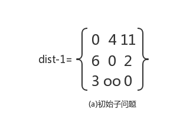
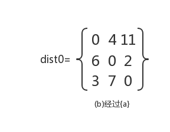
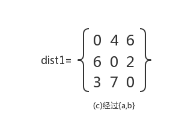
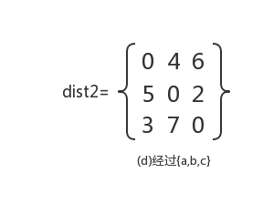

### 多源点最短路径问题
#### 问题描述

- 给定带权有向图G(V,E)对任意顶点vi和vj(i != j)，求顶点vi到顶点vj的最短路径长度。

#### 想法

- 如何定义子问题？
  - 设d(vi,vj,V)是从顶点vi到顶点vj经过顶点集合V的最短路径长度，显然，初始子问题是d(vi,vj,{})，即从vi到vj的弧（若从vi到vj的弧不存在，则将其弧的权值看成oo(正无穷)是最短路径。然后进行下一个阶段的试探，即求解子问题d(vi,vj,{v0})，比较vi,vj和vi,v0,vj的路径长度，取长度较短者作为从vi到vj经过顶点集合{v0}的最短路径。在路径上再增加一个顶点v1，将vi，……，v1，……vj和已经得到的从vi到vj经过顶点集合{v0}的最短路径相比较，取长度较短者作为经过顶点集合{v0，v1}的最短路径。以此类推，在一般情况下，若vi，……，vk和vk，……，vj分别是从vi到vk和vk到vj经过顶点集合{v0，v1，……，vk-1}的最短路径，则将vi，……，vk，……，vj和已经得到的从vi到vj经过顶点集合{v0,v1,……，vk}的最短路径。经过n次比较后，最后得到的必是从vi到vj的最短路径，这就是著名的Floyd算法。设Cij表示有向边<vi,vj>上的权值，由上述动态规划过程得到动态规划函数（0<=i,j<=n-1)：

#### 图的存储

- **邻接矩阵**

#### 输入

- 结点数：n
- 带全路径图：graph[][]

#### 输出

- vi结点到vj结点的最短路径

#### 样例输入

- 3
- `0 4 11`
- `6 0 2`
- `3 oo 0`

#### 样例输出

- 最短路径为：2

#### 子问题求解过程

   

#### 详细代码移步

- [多源点最短路径问题](https://github.com/Mr-Joke/Algorithm/blob/master/Dynamic/src/Floyd.java)
