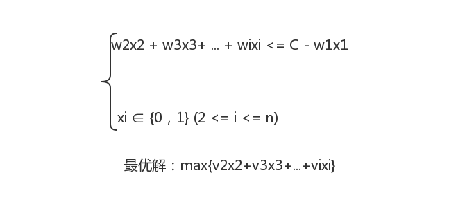
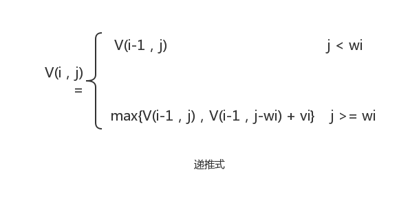

### 0/1背包问题
#### 问题描述

- 给定n种物品和一个背包，物品i(1 <= i <= n)的重量是wi，其价值为vi，背包容量为C，对每种物品只有两种选择：装入背包或不装入背包。如何选择装入背包的物品，使得装入背包中物品的总量最大？

#### 想法

- 首先证明0/1背包问题满足最优性原理。设(x1，x2，……，xn)是0/1背包问题的最优解，则(x2，……，xn)是下面子问题的最优解：

- 子问题的定义，设V(i，j)表示将前i(1 <= i <= n)个物品转入容量为j(1 <= j <= C)的背包获得的最大价值，在决策xi时，已确定了(x1，……，xi-1)，则问题处于下列两种状态之一：
  - 背包容量不足以装入物品i，则装入前i个物品得到的最大价值和装入前i-1个物品得到的最大价值是相同的，即xi = 0，背包不增加价值。
  - 背包容量可以装入物品i，如果把第i个物品装入背包，则背包中物品的价值等于把前i-1个物品装入容量为j-wi的背包中的价值加上第i个物品的价值vi；如果第i个物品没有装入背包，则背包中物品的价值等于把前i-1个物品装入容量为j的背包中所取得的价值。显然，取二者中价值交大者作为把前i个物品装入容量为j的背包中的最优解。则得到递推式如下：

#### 输入

- 物品的数量n
- n个物品的重量
- n个物品的价值
- 背包的容量

#### 输出

- 物品的装入结果
- 背包的最大价值

#### 样例输入

- 5
- {2,2,6,5,4}
- {6,3,5,4,6}
- 10

#### 样例输出

- 1 1 0 0 1
- 15

#### 详细代码移步

- [0/1背包问题](https://github.com/Mr-Joke/Algorithm/blob/master/Dynamic/src/KnapSack.java)

#### 算法分析

- 在算法KnapSack中，第一个for循环的时间性能是O(n)，第二个for循环的时间性能是O(C)，第三个循环是两层嵌套的for循环，其时间复杂度是O(n*C)，第四个for循环的时间性能是O(n)，所以，算法的时间复杂度是O(n*C)。
