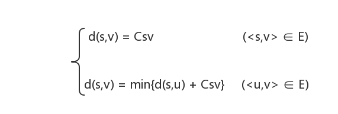
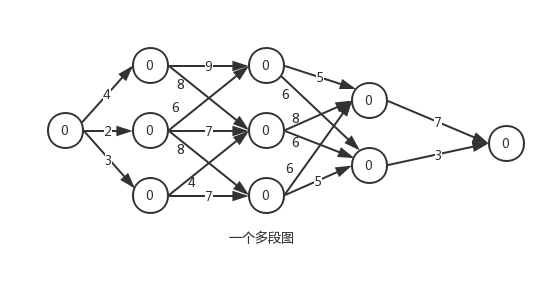

### 多段图最短路径问题
#### 问题描述

- 设图G=(V,E)是一个带权有向图，如果把顶点集合V划分成为k个互不相交的子集Vi(2 <= k <= n,1 <= i <= k)，使得E中的任何一条边<u,v>，必有u ∈ Vi，v ∈ Vi+m(1 <= i < k,1 < i+m <= k)，则图G为多段图，称s ∈ V1为源点，t ∈ Vk为终点。**多段图的最短路径问题**(multi-segment graph shortest path problem)求从源点到终点的最小代价路径。

#### 想法

- 首先证明多段图的最短路径问题满足最优性原理。设s,s1,s2,...,sp,t是从s到t的一条最短路径，显然s1,s2,...,sp,t一定构成一条从s1到t的最短路径，如若不然，设s1,r1,r2,...,rq,t是一条从s1到t的最短路径，则s,s1,r1,r2,...,rq,t将是一条从s到t的路径且比s,s1,s2,...,sp,t的路径长度要短，从而导致矛盾。所以，多段图的最短路径问题满足最优性原理。

- 如何定义子问题呢？设Cuv表示多段图的有向边<u,v>上的权值，将从源点s到终点t的最短路径长度记为d(s,t)，考虑原问题的部分解d(s,v)，显然有下式成立：

- 对于以下多段图，具体划分子问题如下：
- 初子问题：`d(0,1) = C01 = 4(0->1) d(0,2) = C02 = 2(0->2) d(0,3) = C03 =3 (0->3)`
- 下一个阶段子问题：`d(0,4) = min{d(0,1) + C14,d(0,2) + C24} = min{4+9,2+6} = 8(2->4) ...`
- ...

#### 存储

- 多段图的结点数：n
- 多段图关系（邻接矩阵）：graph[][]
- 多段图的权值：graphValue[][]
- 多段图每个结点的最短路径：minValue[]
- 多段图的路径：path[]

#### 输入

- 多段图的结点数：n
- 多段图关系（邻接矩阵）：graph[][]
- 多段图的权值：graphValue[][]

#### 输出

- 多段图最短路径
- 多段图最短路径值

#### 样例输入

- 结点数：10
- 多段图关系：
  - 0 1 1 1 0 0 0 0 0 0
  - 0 0 0 0 1 1 0 0 0 0
  - 0 0 0 0 1 1 1 0 0 0
  - 0 0 0 0 0 1 1 0 0 0
  - 0 0 0 0 0 0 0 1 1 0
  - 0 0 0 0 0 0 0 1 1 0
  - 0 0 0 0 0 0 0 1 1 0
  - 0 0 0 0 0 0 0 0 0 1
  - 0 0 0 0 0 0 0 0 0 1
  - 0 0 0 0 0 0 0 0 0 0
- 多段图权值：
  - 0 4 2 3 0 0 0 0 0 0
  - 0 0 0 0 9 8 0 0 0 0
  - 0 0 0 0 6 7 8 0 0 0
  - 0 0 0 0 0 4 7 0 0 0
  - 0 0 0 0 0 0 0 5 6 0
  - 0 0 0 0 0 0 0 8 6 0
  - 0 0 0 0 0 0 0 6 5 0
  - 0 0 0 0 0 0 0 0 0 7
  - 0 0 0 0 0 0 0 0 0 3
  - 0 0 0 0 0 0 0 0 0 0

#### 样例输出

- 多段图最短路径：9<--8<--5<--3<--0
- 多段图最短路径值：16

#### 详细代码移步

- [多段图的最短路径问题](https://github.com/Mr-Joke/Algorithm/blob/master/Dynamic/src/MSGSPP.java)
