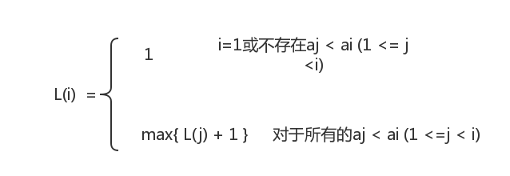

### 最长递增子序列问题
#### 问题描述

- 在数字序列A={a1,a2,...,an}中按递增下标序列(i1,i2,...,ik)(1 <= i1 < i2 < ... < ik <= n)顺序选出一个子序列B,如果子序列B中的数字都严格递增的，则子序列B称为A的递增子序列(incremental subsequence)。最长递增子序列问题(longest incresing subsequence problem)就是找出序列A的一个最长的递增子序列。例如，数字序列{5,2,8,6,3,6,9,7}的一个最长递增子序列是{2,3,6,9}

#### 想法

- 设序列A={a1，a2，……，an}的最长递增子序列是B={b1，b2，……，bm}，首先证明最长递增子序列问题满足最优性原理。

- 设序列A的最长递增子序列的第一个数字是b1，且b1=ai，则问题转化为求{ai，……，an}的最长递增子序列，显然，{b1，b2，……，bm}一定是{ai，……，an}的最长递增子序列，如若不然，设{b1，c1，……，ck}是序列{ai，……，an}的长度大于m的最长递增子序列，则{b1，c1，……，ck}将是序列{a1，……，an}的长度大于m的最长递增子序列，从而导致矛盾。

- 如何定义子问题呢？设L(n)为数字序列A={a1，……，an}的最长递增子序列的长度，显然，初始子问题是{a1}，即L(1)=1。考虑原问题的一部分，设L(i)为子序列A={a1，a2，……，ai}的最长递增子序列的长度，则满足如下递推式：

- 子问题的求解
- L(1) = 1({5})
- L(2) = 1({2})
- L(3) = max{L(1) + 1,L(2) + 1} = 2({5,8},{2,8})
- ...
- L(8) = max{L(1) + 1,L(2) + 1,L(4) + 1,L(5) + 1,L(6) + 1} = 4({2,3,6,7})

#### 输入

- 元素个数n
- n个元素

#### 输出

- 最长递增子序列
- 最长递增子序列的长度

#### 样例输入

- 8
- 5 2 8 6 3 6 9 7

#### 样例输出

- 2 3 6 9
- 4

#### 详细代码移步

- [最长递增子序列问题](https://github.com/Mr-Joke/Algorithm/blob/master/Dynamic/src/MaxIncreaseOrder.java)

#### 算法分析

- 设序列A的长度为n，算法依次对每一个序列的元素进行计算，在求解length[i]时需要考虑array[0]~array[i-1]是否小于array[i]，因此，其时间复杂度为O(n^2)。
