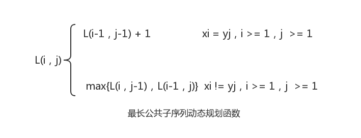
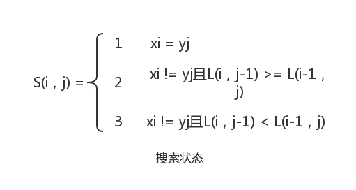

### 最长公共子序列问题
#### 问题描述

- 对给定序列X={x1，x2，……，xm}和序列Z={z1，z2，……，zk}，Z是X的 **子序列**(subsequence)当且仅当存在一个递增下标序列(i1，i2，……，ik)，使得对于所有j=1,2，……，k，有zj = xij(1 <= ij <= m)。例如，对于序列X=(a，b，c，b，d，a，b)，序列(b，c，d，b)是X的一个长度为4的子序列，相应递增下标为(2，3，5，7)。
- 给定两个序列X和Y，当序列Z既是X的子序列又是Y的子序列时，称Z是序列X和Y的 **公共子序列**(public subsequence)。**最长公共子序列问题**(longest public subsequence problem)就是在序列X和Y中查找最长的公共子序列。

#### 想法

- 设序列X={x1，x2，……，xm}和Y={y1，y2，……，yn}的最长公共子序列为Z={z1，z2，……，zk}，首先证明最长公共子序列问题满足最优性原理。记Xk为X序列中前k个连续字符组成的子序列，Yk为序列Y中前k个连续字符组成的子序列，Zk为序列Z中的前k个连续字符组成的子序列，显然有下式成立：
  - 若xm = yn，则 zk = xm = yn，且Zk-1是Xm-1和Yn-1的最长公共子序列；
  - 若xm != yn，且 zk != xm，则Zk是Xm-1和Yn的最长公共子序列；
  - 若xm != yn，且 zk != yn，则Zk是Xm和Yn-1的最长公共子序列。
- 可见，两个序列的最长公共子序列包含了这两个序列的前缀序列的最长公共子序列。因此，最长公共子序列问题满足最优性原理。
- 如何定义子问题呢？设L(m，n)表示序列X={x1，x2，……，xm}和Y={y1，y2，……，yn}的最长公共子序列的长度，显然初始子问题是序列X和Y至少有一个空序列，即：
  - L(0，0) = L(0，j) = L(i，0) = 0  1 <= i <= m，1 <= j <= n
- 考虑原问题的一部分，设L(i，j)表示子序列Xi和Yj的最长公共子序列的长度，当xi = yj时，可以找出Xi-1和Yj-1的最长公共子序列，然后在其尾部加上xi即可得到Xi和Yj的最长公共子序列；当xi != yj时，必须求解两个子问题的解：找出Xi-1和Yj的最长公共子序列以及Xi和Yj-1的最长公共子序列。这两个最长公共子序列中的比较长者即为Xi和Yj的最长公共子序列，则有如下动态规划函数：

- 为了得到序列Xm和Yn具体的最长公共子序列，设二维表S(m，n)记载求解过程中的状态变化，其中S(i，j)表示在计算L(i，j)时的搜索状态，并且有：

#### 输入

- 字符串mainStr
- 字符串modStr

#### 输出

- 最长公共子序列
- 最长公共子序列长度

#### 样例输入

- abcbdb
- acbbabdbb

#### 样例输出

- acbdb
- 5

#### 详细代码移步

- [最长公共子序列问题](https://github.com/Mr-Joke/Algorithm/blob/master/Dynamic/src/MaxPubString.java)
