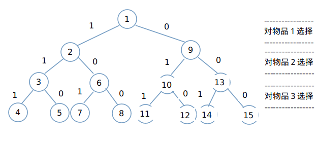

## 回溯法(Back Track Method)
### 1.概述

- **回溯法**(back track method)在包含问题的所有可能解的解空间树中，从根结点出发，按照深度优先的策略进行搜索，对于解空间树的某一个结点，如果该结点满足问题的约束条件，则进入该子树进行搜索，否则将以该结点为根结点的子树进行剪枝。回溯法常常可以避免搜索所有的可能解，所以，适用于求解组合数较大的问题。
- **参考文献：《算法设计与分析(第２版)》**

#### 1.1问题的解空间树

- 复杂问题常常有很多可能的解，这些可能解构成了问题的解空间(solution space)，并且可能解的表示隐含了解空间及其大小。
- 例如，对与n=3的0/1背包问题，其解空间树如下图所示，树中第i层表与第i+1层(1<=i<=n)结点之间的边上给出对物品i的选择结果，左子树表示物品被装入背包，右子树表示物品没有被装入背包。例如结点8代表一个可能解(1,0,0)

#### 1.2回溯法的设计思想

- 回溯法从解空间树的根结点出发，按照深度优先策略搜索满足约束条件的解。在搜索至树中某结点时，先判断该结点对应的部分是否满足约束条件，也就是判断该结点是否包含问题的(最优)解，如果肯定不包含，则跳过以该结点为根的子树，即所谓剪枝(pruning);否则，进入以该结点为根的子树，继续按照深度优先策略进行搜索。

### 2.常见问题

#### 2.1图问题

- [图着色问题](https://github.com/Mr-Joke/Algorithm/blob/master/BackTrack/src/GraphColor.java)
  - [思考过程](https://github.com/Mr-Joke/Algorithm/blob/master/BackTrack/docs/GraphColor.md)
- [哈密顿回路问题](https://github.com/Mr-Joke/Algorithm/blob/master/BackTrack/src/Hamilton.java)
  - [思考过程](https://github.com/Mr-Joke/Algorithm/blob/master/BackTrack/docs/Hamilton.md)

#### 2.2组合问题

- [八皇后问题](https://github.com/Mr-Joke/Algorithm/blob/master/BackTrack/src/EightQueens.java)

#### 2.3其他问题

- [素环数](https://github.com/Mr-Joke/Algorithm/blob/master/BackTrack/src/PrimeCircle.java)
